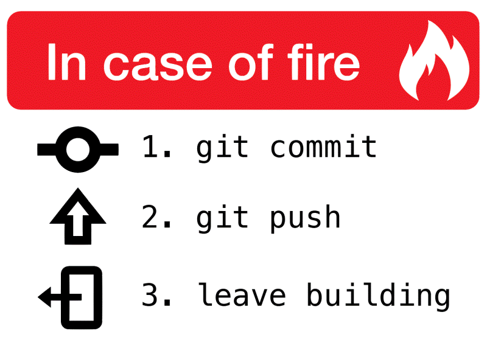

# ПРАВИЛО №1: именуем ветки

Формат: `тип/роль-в-команде/короткое-описание-задачи`

## Типы веток (для всех):

- `feature/` --- новая функциональность
- `fix/` --- исправление бага
- `hotfix/` --- срочное исправление в прод
- `refactor/` --- улучшение кода без изменения логики
- `docs/` --- только обновление документации
- `chore/` --- обновление зависимостей, настройка инструментов

## Роль в команде (тег для понимания):

- `back/` --- бэкенд-задача
- `front/` --- фронтенд-задача
- `analytics/` --- задача аналитика (метрики, события, схемы)
- `common/` --- общая задача (затрагивает несколько направлений)

## Примеры веток для разных ролей:

- Для бэкендера:
  - `feature/be/add-user-search-api`
  - `fix/be/validation-for-email-field`

- Для фронтендера:
  - `feature/fe/new-settings-modal`
  - `fix/fe/button-hover-on-mobile`

- Для аналитика:
  - `feature/analytics/add-purchase-event`
  - `docs/analytics/update-tracking-spec`

- Общая задача:
  - `feature/common/new-push-notification-system`

---

# ПРАВИЛО №2: пишем коммиты

Формат: `тип(область/модуль): чёткое описание на русском`

## Типы коммитов:

- `feat:` --- новая функция
- `fix:` --- исправление бага
- `refactor:` --- рефакторинг кода
- `docs:` --- изменение документации
- `style:` --- правки стилей
- `test:` --- добавление или правка тестов
- `chore:` --- рутинные задачи (обновление пакетов, настройка)

## Примеры области/модуля (указываем что именно меняли):

- Для бэка: `auth`, `user`, `payment`, `api`, `docker`, `migration`
- Для фронта: `header`, `login-form`, `product-card`, `router`, `store`
- Для аналитики: `analytics`, `metrics`, `amplitude`, `logs`
- Общее: `config`, `readme`, `ci/cd`

## Примеры коммитов по ролям:

- Бэкендер:
  - `feat(user): добавлен эндпоинт для поиска по имени`
  - `fix(auth): исправлена проверка токена при 401 ошибке`

- Фронтендер:
  - `feat(settings): добавлена тёмная тема переключателя`
  - `style(product-card): добавлены отступы в мобильной версии`

- Аналитик:
  - `docs(analytics): обновлена спецификация событий для корзины`
  - `feat(metrics): добавлено событие "помощь_открыта"`

---

# Правило №3: пушим изменения

- `main` / `master` --- это святыня, всегда работает. Не пушь туда напрямую!  
  Любая правка = новая ветка.
- Ветка `develop` --- наша площадка для интеграции, с неё собираем тестовые стенды.
- Перед началом работы и перед созданием PR делай:  
  `git pull origin main` (или `master`).  
  Это как утренний кофе --- обязательно!
- `.gitignore` --- наш друг. Не коммить логи, конфиги с паролями и т. п.
- Перед пушем прогнал линтер и тесты? Ты молодец!

Когда код готов, ты не пушишь его в `main`. Вместо этого идешь на GitHub и создаёшь новый Pull Request.

## В этом PR:

- Даёшь понятное название (например, "Добавлена валидация email в форме регистрации").
- Подробно описываешь, что ты сделал, зачем и как это проверить.
- Назначаешь ревьювером нашего техлида. Он смотрит твой код, оставляет замечания и даёт добро на слияние (мерж).

Только после того, как техлид одобрит твой PR, можно нажать "Merge".

---

## После слияния:

- Смержили PR? Поздравляю!
- Удали ветку на удаленном репозитории (в GitHub есть кнопочка).
- Локальные ветки тоже можно почистить:  
  `git branch -d feature/name`

---

## Как это работает в связке на практике:

1. Аналитик создаёт ветку для документации:  
   `git checkout -b docs/analytics/update-funnel-spec`

2. Делает коммиты:  
   `docs(analytics): добавлен этап "подтверждение_телефона" в воронку`

3. Создаёт PR, назначает ревью --- техлиду.

4. Фронтендер берёт задачу на кнопку. Ветка:  
   `git checkout -b feature/fe/add-save-button`

5. Коммиты:  
   `feat(checkout): добавить кнопку "Сохранить черновик"`  
   `style(checkout): изменить цвет кнопки по макету`

6. Создаёт PR и назначает техлиду.

7. Техлид видит из названия ветки и коммитов: кто, что и зачем делал. Одобряет, даёт правки или мержит.

---

## И ПОМНИТЕ!

